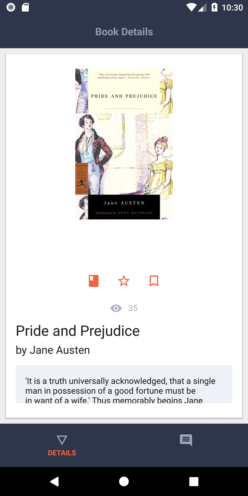
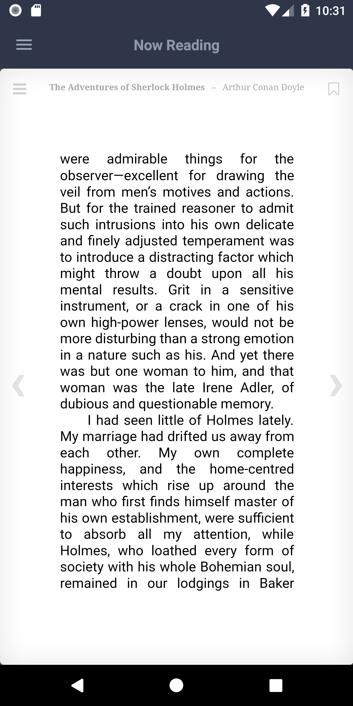

BookApp (Angular, Nativescript-Angular, apollo-graphql)

This is client for https://github.com/denlysenko/bookapp-api

Web app can be found here:

https://bookapp-angular.netlify.com/auth

Native apps some screenshots:

 

 

 

- [More Screenshots](screenshots/)
